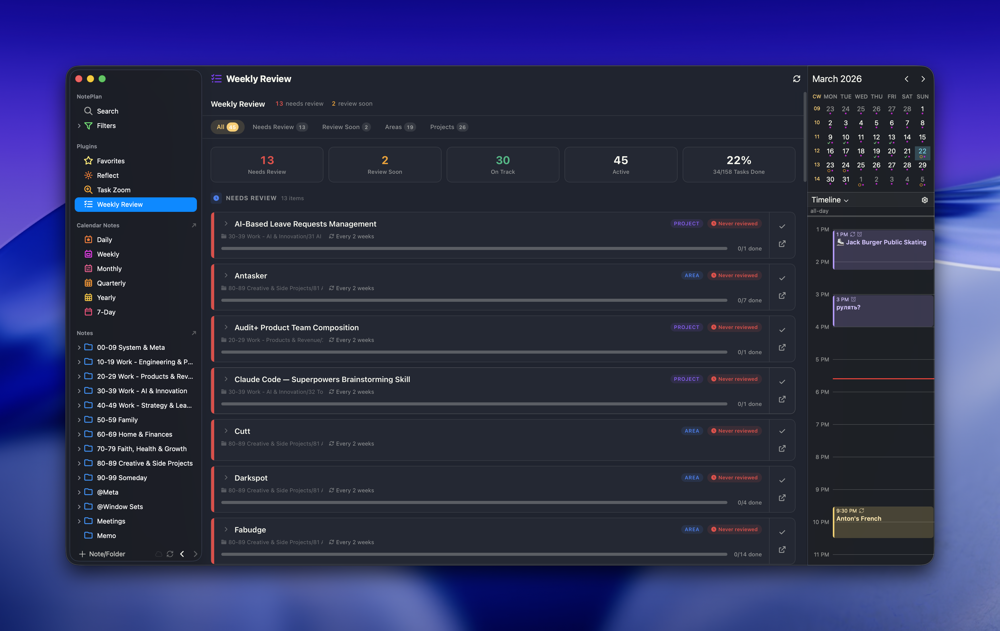

# Weekly Review for NotePlan

A project and area review dashboard for [NotePlan](https://noteplan.co). Track review schedules across all your projects and areas of responsibility, see which ones need attention, and manage tasks within each.



## Features

- **Review scheduling** — automatically detects `@review(interval)` and `@reviewed(date)` tags in your notes to calculate when each project/area is due for review
- **Smart categorization** — separates items into Needs Review (overdue), Review Soon (due within 2 days), On Track, No Schedule, and Inactive (paused/completed/cancelled)
- **Summary dashboard** — at-a-glance stats showing how many items need attention, average completion rate, and overall task progress
- **Filter tabs** — quickly filter by All, Needs Review, Review Soon, Areas, or Projects
- **Task progress** — each card shows a progress bar with completion count, expandable to see individual tasks
- **Task management** — complete tasks, add new tasks, and navigate to the source note directly from the review card
- **Review actions** — mark items as reviewed (updates `@reviewed` date) or open the note for detailed review
- **Type badges** — visual distinction between Projects and Areas with colored badges
- **Markdown rendering** — task titles render bold, italic, code, links, and highlight hashtags/mentions in orange
- **Mobile-friendly** — responsive card layout that works on iPad and iPhone
- **Light and dark theme** — adapts to NotePlan's current theme

## How It Works

The plugin scans your project notes for frontmatter or inline tags:

- `#project` or `#area` — identifies the note type
- `@review(1w)` / `@review(2w)` / `@review(1m)` — sets the review interval
- `@reviewed(2026-03-15)` — records when you last reviewed it
- `@start(2026-01-01)` — project start date
- `@due(2026-06-30)` — project deadline
- `@paused` — marks a project as paused (moved to Inactive section)
- `@completed(date)` / `@cancelled(date)` — marks as finished

## Installation

1. Copy the `asktru.WeeklyReview` folder into your NotePlan plugins directory:
   ```
   ~/Library/Containers/co.noteplan.NotePlan*/Data/Library/Application Support/co.noteplan.NotePlan*/Plugins/
   ```
2. Restart NotePlan
3. Weekly Review appears in the sidebar under Plugins

## Settings

- **Folders to Exclude** — comma-separated folder names to skip (e.g., `@Archive, @Templates, 00-09 System`)

## License

MIT
