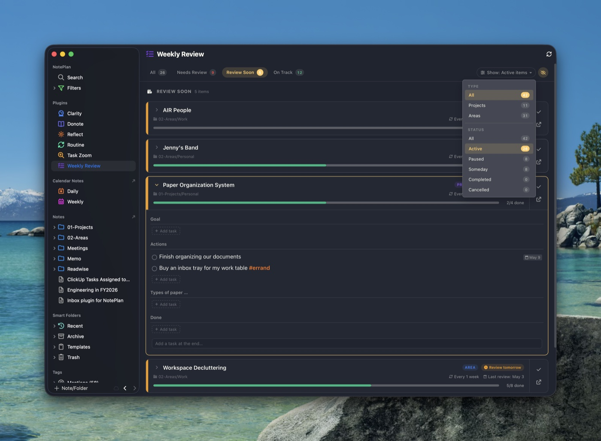

# Weekly Review for NotePlan

A project and area review dashboard for [NotePlan](https://noteplan.co), inspired by OmniFocus's review workflow. Track when each project or area is due for review, manage their tasks inline, and keep moving.



## Features

- **Review scheduling** — each project/area has a review interval and a last-review date; the dashboard groups items by Needs Review, Review Soon, On Track, No Schedule, and Inactive
- **Inline editing** — click `Every 1 week` on any card to change the interval (presets + custom values like `10d`, `6w`); mark items reviewed in one click
- **Tasks at a glance** — expand any card to see its tasks grouped by heading. Toggle done/cancelled, set priority, schedule, reorder, add new tasks at the end of any section, and move completed tasks to a `## Done` section at the bottom
- **Persistent filters** — the filter bar remembers your last selection: review status (pills) plus a Show dropdown grouping by type (project/area) and lifecycle status (active/paused/someday/completed/cancelled), and a toggle to hide completed tasks
- **Auto-archive** — when a card has no open tasks, an archive button appears that moves the note to `@Archive/YYYY-MM-DD/<original folder>/`
- **Theme-aware** — adapts to NotePlan's current light/dark theme and tint colour
- **Repeat-aware** — if a completed task has `@repeat(...)` and the [Routine plugin](https://github.com/asktru/noteplan-routine) is installed, the next occurrence is generated automatically

## How a project/area is recognised

The plugin scans every project note in your vault (excluding the folders configured in settings) and treats a note as a project or area when **any** of these is true:

- **Frontmatter** (preferred):
  ```yaml
  ---
  type: project        # or: area
  review: 1w           # interval — d/w/m/q/y
  reviewed: 2026-04-25 # last review date (optional)
  status: active       # active | working | paused | someday | completed | canceled
  start: 2026-01-01    # optional
  due: 2026-06-30      # optional
  ---
  ```
- **Legacy inline syntax** (still supported):
  - `#project` or `#area` to mark the note type
  - `@review(1w)` for the interval
  - `@reviewed(2026-04-25)` for the last-review date
  - `@paused`, `@completed(date)`, `@cancelled(date)` for lifecycle state

Frontmatter takes priority when both are present. Lifecycle is derived from `status:` if set, otherwise from the legacy `@completed`/`@cancelled`/`@paused` markers.

### Review intervals

`<n><unit>` where unit is `d` (days), `w` (weeks), `m` (months ≈ 30d), `q` (quarters ≈ 91d), or `y` (years). Examples: `1w`, `2w`, `10d`, `1m`, `1q`.

A project becomes **overdue** the day it's due, **review soon** within 2 days, and **on track** otherwise.

## Commands

| Command | Description |
|---|---|
| `Open in sidebar` (alias `wrd`, `weekly review`) | Opens the dashboard in the sidebar |
| `Open in separate window` (alias `wrw`) | Opens the dashboard in a floating window |
| `Mark as Reviewed` (alias `review done`) | Marks the currently open note as reviewed today |
| `Turn into project` (alias `make project`) | Adds `type: project` frontmatter to the current note and migrates any inline `@review`/`@reviewed` to frontmatter |
| `Turn into area` (alias `make area`) | Same as above, for areas |

## Settings

- **Project/Area Tags** — comma-separated tags used for legacy detection (default: `#project, #area`)
- **Folders to Exclude** — comma-separated folder names skipped during scan (default: `@Archive, @Trash, @Templates, Memo, Meetings`)
- **Append Completion Date** — when `true`, completing a task appends `@done(date time)` (matches NotePlan's own setting)
- **Review Mention** / **Reviewed Mention** — customise the mention strings used by the legacy syntax (defaults: `@review`, `@reviewed`)

## Installation

1. Copy the `asktru.WeeklyReview` folder into your NotePlan plugins directory:
   ```
   ~/Library/Containers/co.noteplan.NotePlan*/Data/Library/Application Support/co.noteplan.NotePlan*/Plugins/
   ```
2. Restart NotePlan
3. Open the dashboard from the sidebar (look for the Weekly Review icon) or run `/wrd`

## License

MIT
